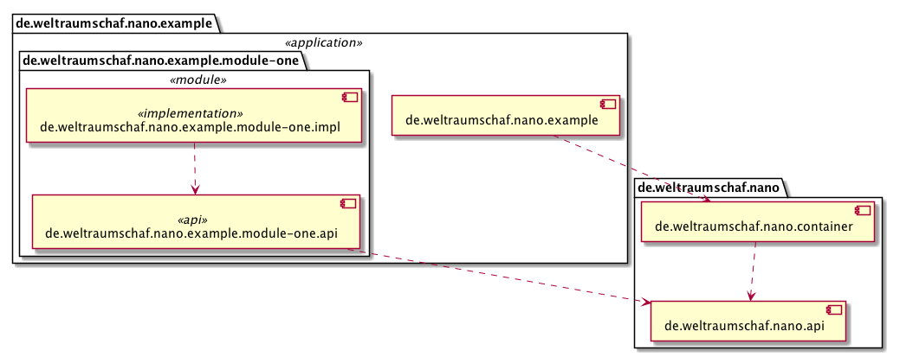

# Nano

A very simple container to run services (inspired by OSGi).

## Architecture

* An application consists of _modules_.
* A module consists of of two submodules:
    1. an API module.
    2. an implementation (of the API) module.
* A _module_ provides _services_ via interface.
* A _module_ exposes itself via [SPI][spi].
    * implementing a _module descriptor_ interface (in the API module) 
* The service implementation exposes itself via [SPI][spi].
* _Container_
    * The container loads all implementations of the _module descriptor_ interface.

[spi]:  https://docs.oracle.com/javase/7/docs/api/java/util/ServiceLoader.html
